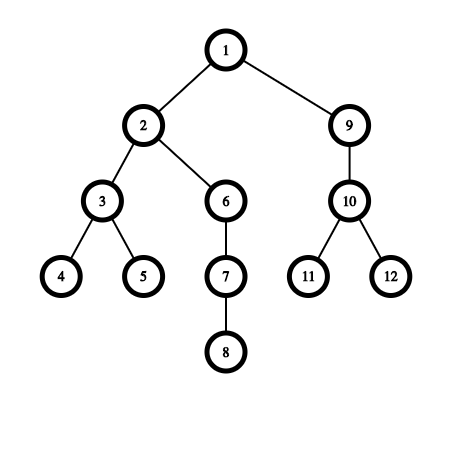
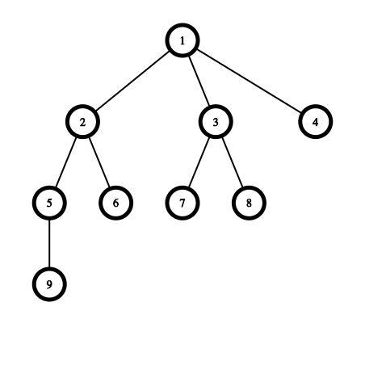

# FuryDumper 🧙‍

Добро пожаловать гем для быстрого и легкого дапма из удаленой БД!

Данная библиотека поможет вам получить дамп из удаленной базы данных в main service или других микросервисах, имеющих гем `fury_dumper`.\
*Доки можно почитать на других языках: [English](README.md).*

В этом репозитории вы найдете файлы, необходимые для данной библиотеки на Ruby. 
Если хотите помочь - кодить туть  `lib / fury_dumper` 😊.\
*Особенности разработки здесь: [English](README.md#dev-documentation), [Russian](README.ru.md#документация-для-разработчиков).*

## Установка

Пишем в Gemfile вашего проекта:

```ruby
gem 'fury_dumper'
```

Выполняем:

    bundle install

В одиночку можно установить так:

    gem install fury_dumper

## Использование

### Конфиги

Чтобы создать дефолтную конфигурацию:

    bundle exec rails generate fury_dumper:config

Для корректной работы с другими микросервисами необходино настроить `fury_dumper.yml` конфиг. Описание его структуры:

```yaml
# Размер батча на первой итерации
#
# Не обязательный; по умолчанию 100 
batch_size: 100

# Соотношение количества записей (fetching_records), выгружаемых из БД, к размеру батча
# Формула: fetching_records = ratio_records_batches * batch_size
# fetching_records выступает в роли значения limit'а для sql запросов
#
# Не обязательный; по умолчанию 10
ratio_records_batches: 10

# Режим обхода графа связей -  в ширину(:wide) или глубину(:depth)
#
# Не обязательный; по умолчанию обрабатывает связи в ширину  
mode: wide

# Связи которые будут исключены из дампа,
# полезно для оптимизации скорости выгрузки и исключения
# из нее лишних данных:
#   < имя класса >.< имя связи >
#
# Не обязательный; по умолчанию пустой массив
exclude_relations: User.friends, Post.author

# По умолчанию данные выгружаются быстро (без сортироки)
# fast режим позволяет выгружать записи, отсортированные по превчиному ключу(false) или нет(true),
# полезно для при создании дампов для разработчиков.
#
# Не обязательный; по умолчанию true
fast: true

# Список микросервисных связей
#
# Не обязательный
relative_services: 
  # Имя микросервиса
  #
  # Не обязательный
  post_service:
    # Имя удаленной БД для данного микросервиса
    # с которой будут тянуться данные    
    #
    # Обязательный    
    database: 'post_service_development_dump'

    # Хост для удаленной БД
    #
    # Обязательный
    host: 'localhost'

    # Порт для удаленной БД
    #
    # Обязательный
    port: '5432'

    # Имя пользователя для удаленной БД
    #
    # Обязательный
    user: 'user'

    # Пароль для удаленной БД
    #
    # Обязательный
    password: 'password'

    # Список таблиц, имеющих связи с микросервисом (post_service)
    #
    # Обязательный
    tables:
      # Имя таблицы с текущем сервисе      
      #
      # Обязательный
      users:
        # Имя таблицы в микросервисе (post_service)
        #
        # Обязательный
        users:
          # Имя колонки к таблице данного сервиса (users)
          # 
          # Обязательный
          self_field_name: 'id'

          # Имя модели в микросервисе (post_service)
          # 
          # Обязательный
          ms_model_name: 'User'

          # Имя колонки к таблице микросервиса (involved_users)
          # 
          # Обязательный
          ms_field_name: 'root_user_id'
      root_posts:
        posts:
          self_field_name: 'id'
          ms_model_name: 'Post'
          ms_field_name: 'root_post_id'
  logs_service:
    database: 'logs_service_development_dump'
    host: 'localhost'
    port: '5432'
    user: 'user'
    password: 'password'
    tables:
      users:
        logs:
          self_field_name: "log :: json - >> 'id'"
          ms_model_name: 'Log'
          ms_field_name: 'id'
```

### Routing для микросервисов

Необходимо добавить этот код в `config/routes.rb` для того, чтобы предоставить возможность другим микросервисам дампать БД данного проекта.

```ruby
  mount FuryDumper::Engine => "fury_dumper" unless Rails.env.production?
```

### Вызов основной фукции

**⚠️ ⚠️ ⚠️ Внимание! При копировании данных, в случае конфликта с имеющимися данными, более приоритетными считаются в удаленной БД (текущие перетрутся)! ⚠️ ⚠️ ⚠️**

Для того, чтобы начать дамп с удаленной БД, в консоле укажите команду:

```ruby
FuryDumper.dump(password:     'password', 
                  host:         'localhost',
                  port:         '5632',
                  user:         'username',
                  model_name:   'User',
                  field_name:   'token',
                  field_values: ['99999999-8888-4444-1212-111111111111'],
                  database:     'staging',
                  debug_mode:   :short)
```

Возможно, для подключения к удаленному хосту, будет необходимо выполнить ssh команду. Пример для БД стейджа феликса:
```
ssh -NL <local_port>:<host>:<db_port> username@<host>
```

Описание аргументов:

| Аргумент | Описание |
| --- | --- |
| host | хост для удаленной БД |
| port | порт для удаленной БД |
| user | имя пользователя для удаленной БД |
| password | пароль для удаленной БД |
| database | имя БД |
| model_name |имя модели для дампа |
| field_name | имя поля, по которому будет дамп (например - 'id' или 'admin_token', default='id') |
| field_values | значения поля field_name |
| debug_mode | режим отладки (full выводит все сообщения, short - короткие сообщения, none -  ничего) |
| ask | запрашивать подтверждение пользователя при различиях в текущей и удаленной БД |

### Примерчики

В этих примерах не обязательно менять `fury_dumper.yml` конфиг, возмите [дефолтный](README.ru.md#конфиги). 

Дамп пользователя по admin_token:
```ruby
FuryDumper.dump(password:     'password', 
                  host:         'localhost',
                  port:         '5632',
                  user:         'username',
                  model_name:   'User',
                  field_name:   'admin_token',
                  field_values: [admin_token_value],
                  database:     'staging',
                  debug_mode:   :short)
```
Дамп 1000 пользователей (здесь можно подкрутить batch_size - по умолчанию batch_size = 100, чтоб дампер отработал не 10 раз):
```ruby
FuryDumper.dump(password:     'password', 
                  host:         'localhost',
                  port:         '5632',
                  user:         'username',
                  model_name:   'User',
                  field_values: (500..1500),
                  database:     'staging',
                  debug_mode:   :short)
```
Дамп AdminUser:
```ruby
FuryDumper.dump(password:     'password', 
                  host:         'localhost',
                  port:         '5632',
                  user:         'username',
                  model_name:   'AdminUser',
                  field_values: 3368,
                  database:     'staging',
                  debug_mode:   :short)
```

Дамп со стейджа:

```bash
ssh -NL <port>:<host>:<hostport> username@<host>
```

```ruby
FuryDumper.dump(password:     'password', 
                  host:         'localhost',
                  port:         '5632',
                  user:         'username',
                  model_name:   'User',
                  field_values: 1,
                  database:     'staging',
                  debug_mode:   :short)
```
Дамп с реплики прода:

```bash
ssh -NL <port>:<host>:<hostport> username@<host>
```

```ruby
FuryDumper.dump(password:     'password', 
                  host:         'localhost',
                  port:         '5632',
                  user:         'username',
                  model_name:   'User',
                  field_values: 1,
                  database:     'production',
                  debug_mode:   :short)
```

### Статистика 📈

Статистика дампа с реплики main service (конфигурация стандартная, см [этот конфиг](README.ru.md#конфиги))

| Количество user | Количество связанных сущностей | Время |
| --- | --- | --- |
| 1 | ~ 150* | 2 min 14 sec |
| 10 | ~ 3 500* | 6 min 15 sec |
| 100 | ~ 10 000* | 11 min 8 sec |
| 1 000 | ~ 10 000* | 16 min 6 sec |

\* Операции тащаться несколько раз по разным путям и могут дублироваться между собой, из-за этого представленное в таблице число примерно равно количеству уникальных записей в БД. 

Примечание: Время выполнения может отличаться для разных юзеров в зависимости от количества связанных сущностей.
 
# Документация для разработчиков

Сокращения для большего удобства
* PK - primary key
* FK - foreign key
* remote DB - удаленная БД, из которой будут тянуться даные
* target DB - текущая БД, в которую будет осуществлено копирование


## Обход графа связей

В данный момент реализовано 2 варианта обхлда графа связей - в глубину и в ширину.

### Обход в глубину

Как работает алгоритм вкратце:

1. Находим модель
2. Находим все связи модели
3. Для каждой связи:   
    1. Находим все данные (PK/FK, их значения и тд)
    2. Дампаем найденную связь

То есть классический обход в глубину



### Обход в ширину

Как работает алгоритм вкратце:

1. Получаем модель для дампа (входные данные) и добавляем ее в очередь моделей
2. Пока в очереди есть модели
    1. Текущей моделью считаем первую в очереди
    2. Копируем данную модель из remote DB
    3. Для каждой связи данной модели:
        1. Находим все данные (PK/FK, их значения и тд)
        2. Помещаем  связанную модель в конец очереди

То есть классический обход в ширину



По умолчанию дампер работает в ширину. Это решение принято, в связи c тем, что дампер считает ближние связи более приоритетными.\
Но можно явно заставить дампер работаь в глубину, указав в конфигурационном файле `fury_dumper.yml` строку `mode: depth`.

## Обработка связей у конкретной модели

У каждой рассматриваемой модели есть множество связей, мы рассматриваем практически все. Вот список рассматриваемых свзяей:
* has_one и has_many (рассматриваем вместе; has_one не учиывается как LIMIT 1, таким образом преобразовываясь в has_many)
* belongs_to
* has_and_belongs_to_many

Но есть несколько исключений, например игнорируются связи through.

И немножко о скоупах в связи - они учитываются. Но если есть более широкая (покрывающая связь) - без sсope, то будет дампаться только покрывающая связь. 

Например - у пользователя есть все документы и главный документ:
* has_many :documents, class_name: 'User::Document'\
* has_one :main_document, -> { main }, class_name: 'User::Document'

Связь main_document не будет учтена при дампе в связи с тем, что documents - покрывающая связь, так как более широкая и без sсope.\
Если бы связи documents не было, main_document дампалась бы с условием.

Также у моделей учитываются полиморфные связи ( `belongs_to :resource, polymorphic: true` и `has_many :devices, as: :owner` ).

### Обработка связей has_and_belongs_to_many

Связи has_and_belongs_to_many имеют проксирующую таблицу, которую тоже необходимо сдампать. Это происходит в момент обработки модели у которой есть данная связь.

### Особенности работы c as-связями

Связи типа as обрабатываются немного отлично от остальных. В связи с тем, что к этой таблицу может быть множество связей и они не будут дублирующимися, неся каждая свой смысл и потерять их нельзя.\
Например, связь для юзера `has_many :devices, as: :owner` может присутствовать и у лида. И в идеальой вселенной 🦄 нужно вытащить обе.\
Для того, чтоб дампать обе модели, было принято решение записывать путь связей (только as) по которой пришла модель. И если один из путей является подпутем для другой модели, то они одинаковые и не будут дампаться.

## Режим быстрых запроов

Режим быстрых sql-запросов рабоатет без сортировки по первичному ключу. Если вы хотите сдампать **последние** записи в модели, установите `fast: false` в конфиге. \
В быстром режиме sql запросы выглядят так:
```sql
SELECT * FROM table WHERE fk_id IN (...) LIMIT 1000;
```
В не быстром режиме sql запросы выглядят так:
```sql
SELECT * FROM table WHERE fk_id IN (...) ORDER BY table.id LIMIT 1000
```
Но небыстрый режим делает запросы медленнее из-за того, что pg-планировщик строит запрос по индексу первичного ключа, а fk_id IN (...) фильтрует при сортировке, что работет дольше.

## Кратко о классах

* FuryDumper - инициирует процесс дампа, осуществляет батчинг на первой итерации
* FuryDumper::Dumper - основной класс, который осуществляет процесс дампа, здась лежит основной алгоритм обхода связей
* FuryDumper::Dumpers::Model - класс модели
* FuryDumper::Dumpers::ModelQueue - очередь моделей для дампа в ширину
* FuryDumper::Dumpers::DumpState - класс состояния дампа, тут хранится информация о тех моделях, что уже дампали и подводится небольшая статистика по дампу
* FuryDumper::Dumpers::RelationItem - структура связи - ключи и значения, по которым дампали. Для обычных моделей в RelationItem сравнивается между собой только по ключам. Additional опция дает возможность сравнить по ключу и значению. Complex - явно говорит о том, что будет только ключ, то есть в ключе содержится строка типа `date_from IS NULL`, являющаяся условием для связи. 
* FuryDumper::Api - класс для связи с микросервисами
* FuryDumper::Config - класс конфига
* FuryDumper::Encrypter - класс для шифрования паролей
